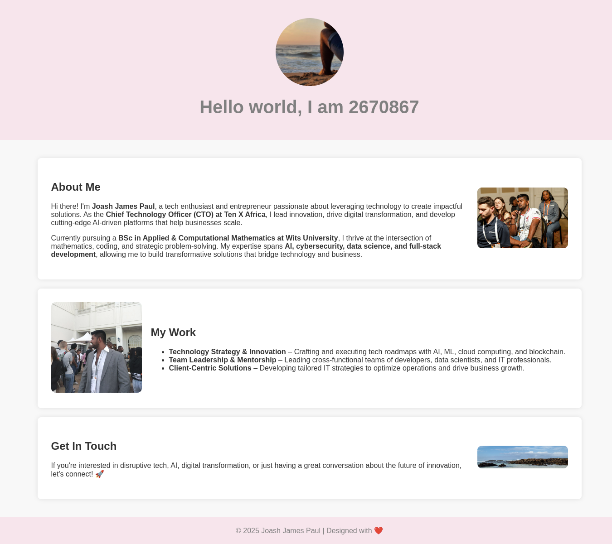

# About Me Website

This is a personal portfolio website for **Joash James Paul**. It provides information about my background, work, and contact details. The site is designed to be responsive, modern, and visually appealing with a red theme.

## Features
- **Responsive Design**: Works on both desktop and mobile devices.
- **Professional Layout**: Includes sections for About Me, Work, and Contact.
- **Dynamic Styling**: Clean and modern user interface.
- **Images**: Uses profile and content-related images to enhance aesthetics.
- **HTML, CSS & JavaScript**: Built using standard web technologies.

## Structure
The project contains the following files:
- `index.html` - The main webpage.
- `profile.jpg` - Profile image displayed in the header.
- `about-me.jpg`, `work.jpg`, `contact.jpg` - Additional images for content sections.
- `styles.css` (if separated) - Styles for improving design.

## How to Use
1. Clone the repository:
   ```bash
   git clone https://github.com/yourusername/about-me-website.git
   ```
2. Open `index.html` in a web browser.

## Screenshot


## Technologies Used
- **HTML**: Structure of the website.
- **CSS**: Styling and responsive layout.
- **JavaScript**: Future enhancements (if needed).

## Contact
For more information, feel free to connect:
- **LinkedIn**: [Joash James Paul](https://www.linkedin.com/in/joash-james-paul-813023259/)
- **Email**: your.email@example.com

## License
This project is open-source and available under the [MIT License](LICENSE).